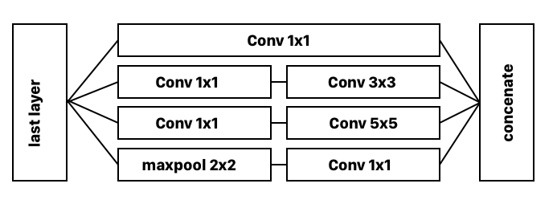

# ConvNet architectures 

{{TOC}}

## Træning af ConvNets

CNN er en kategori af neurale netværk der har vist sig at være effektive til billede genkendelse og klassifisering; her i blandt til ansigter, objekter, skilte og så videre, til f.eks brug i robotter og selv kørende biler.

Denne process udkommer fra at en cnn kan beskrives som to dele, en encoder og en decoder.

Encoderen har til mål at udtrække features fra et billede, altså at generalisere hvad et billede består af ned til simple dele. Det er så decoderens job ud fra disse informationer at forstå hvad billedet repræsentere afgrænset af de mulige kategorier.

### Layers

For at dette kan virke, består netværket af nogle layers som besidder nogle filtre og vægte, altså matricer af tal. Det er disse som træningen handler om, og har man succesfuldt trænet et netværk, vil man kunne se at de forskellige layers lærer forskellige ting.

### Transfer learning

Men at træne sådan et netværk, til at kunne beside så komplekse vægte; kan

> **Træning af CNN**
> 
> 1. Tage lang tid
> 2. Kræve et kæmpe dataset

Hvorfor det kan være godt at udnytte transfer-learning.
Hvis man opbygger sit netværk omkring transfer learning, betyder det at man bruger en pre-trænet encoder, og så bruger sin egen decoder som man så træner.

Bruger man ImageNet som dataset, vil det normalt tage flere uger at træne sit netværk, men ved at bruge Transfer Learning kan det gøres omkring en times tid.

En CNN har jo typisk i sin decoder, flere fully connected lag, så lad os stille to forskellige scenario op:

Hvis man har et lille dataset selv, så erstat kun det sidste FC lag, da man ellers vil kunne komme til at overfitte.
> Lille dataset = sidste FC

Hvis man har et stort dataset selv, så erstat flere af de fully connected layers.
> Stort dataset = flere FC

Har men gjort det, så fryser man vægtene på alle de lag man ikke har erstattet og begynder at træne med sit eget dataset.
Man kan derefter _fine-tune_ sit netværk ved at unfreeze lagene igen og træne lidt på hele netværket.

## AlexNet

AlexNet var en revolution inden for machine learning, det var det første til at bruge ReLU, og er populært brugt som base for Transfer Learning grundet dets ligetil struktur.
AlexNet er som så et simpelt netværk, der tager input af 277x277x3.

Det består af otte lag.
De første fem er convolutionelle lag, nogle efterfulgt af maxpool.
Og til sidste er der tre fully connected lag.

> * Conv > maxpool > norm
> * Conv > maxpool > norm
> * Conv > Conv > Conv
> * maxpool
> * FC > FC > FC

## VGGNet

Men AlexNet bruger nogle store filter størrelser på sine convolution lag, helt op til 11x11.

Med VGGNet var målet at få langt færre parameter, som de opnår ved at bruge flere convolutions i træk med en filter størrelse på 3x3.

Og vi kan tage et eksempel på at det virker.

Hvis vi har et input billede på 5x5, og Alexnet bruger et filter på samme størrelse, med stride 1; så er det tydeligt at vi har et output på størrelsen 1; men for god ordens skyld kan vi bruge formlen:

> $outputsize = \frac{inputsize - filtersize}{stride} + 1$

Derved har vi for AlexNet:

> $\frac{5 - 5}{1} + 1 = 1$

Og med VGG og dobbelt conv får vi:

> * Conv1: $\frac{5 - 3}{1} + 1 = 3$
> * Conv2: $\frac{3 - 3}{1} + 1 = 1$

Men så kan vi så spørge os selv - og hvad er pointen så?\
Jo med et filter på 5x5 er der 25 parameter, men med to filter af 3x3, er det 18 i alt; så vi når frem til det samme, men med et mindre antal af parametre.

## GoogleNet

GoogleNet er et meget anderledes netværk, det har i midten nogle 1x1 convolutions, som den bruger til noget den kalder “inception”, og så bruger GAP til sidst i stedet for FC.

### 1v1 conv 
Ved at bruge 1x1 conv, reducere GoogleNet sin depth, der kan bruges til at spare mange udregninger.

Google Net skulle bruge det til at reducere udregninger et sted i deres netværk fra 100 millioner til 5 millioner.

### Inception

Typisk bruger man conv layers af 5x5 eller 3x3 eller også bruger man et maxpool layer, og hver er gode at bruge og kan være svære at vælge imellem; så hvorfor ikke bare bruge dem alle sammen?

Inception modulet, som sidder i GoogleNet gør netop dette.
Fra et lag, bliver der outputtet både til 1x1, 3x3, 5x5 og et maxpool, der så alle bliver concanated sammen. For at spare på udregningerne, bliver 3x3 og 5x5 conv med 1x1 først, og maxpool efter.

### GAP

Skulle man bruge FC layers til decoder delen, ville der skulle bruges mange vægte. Ved at bruge Global Avarage Pooling, laves hver feature map om til en 1x1 hvilket kræver nul vægte og skulle gøre accuracyen 0.6 bedre.

### Auxiliary Classifiers

GoogleNet besidder en sidste interresandt ting; i løbet af netværket er der nogle classifier outsputs.

Disse bruges under træning kun, og deres loss ligges til den samlede loss med en vægt på 0.3, der skulle modarbejde vanishing gradients.

## Layer Activations

Så det var tre forskellige netværker, og det kan godt være lidt svært sådan at forstå hvordan og hvorfor de virker; da man har meget lille indsigt i træningen og de ting der sker.

Derfor kan det være meget smart at man kan visualisere de forskellige layers aktivationer og filtre. Det tillader os blandt andet at:

> * Observer stimuli for feature maps
> * Observer feature maps udvikling under træning
> * Lave bedre designs!

For at visualisere aktivationer, er den nemmeste måde er at visualisere de forskellige kanaler ved et forward pass. Når vi kommer længere ned i netværket, vil nogle kanaler virke tomme, grundet at det pattern de repræsentere ikke var tilstede i billedet.

## Rekonstruktion

Hvad nu hvis vi _vendte_ netværket om? Så det rent faktisk lavede billeder for os i stedet for?

Ideen er, at vi stadig giver netværket et billede, men dette billede bruger netværket til at beskrive hvilken content den skal lave et nyt billede af.

Vi vil nu ved at give et _content_ billede _x_ til netværket, finde det billede _y_ der gør at outputtet ved laget _l_ nærmest er det samme. Det betyder, at ud fra et content billede _x_ vil vi genere et nyt billede, hvor at de ved laget _l_ matcher hinandens feature maps.

Det virker ved at vi optimere på billedet i stedet for vægte. Så hvis vi initialisere vores billede _y_ med random noise, og vi smider _x_ igennem netværket, så vil optimeringen ske på y i stedet for de forskellige vægte.

Des dybere laget for outputtet er, des mere _abstract_ ser resultatet ud.

