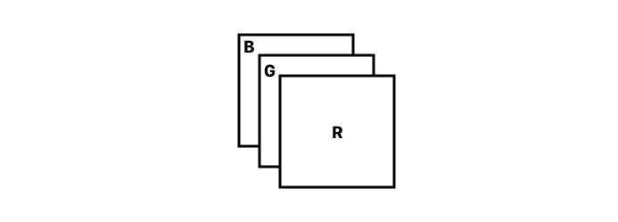
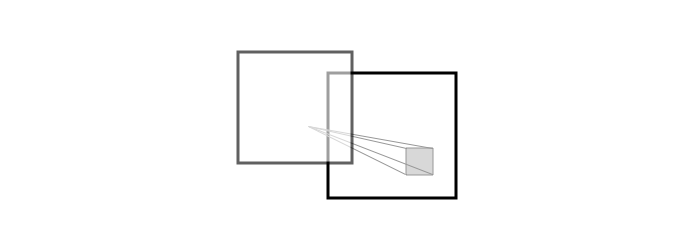
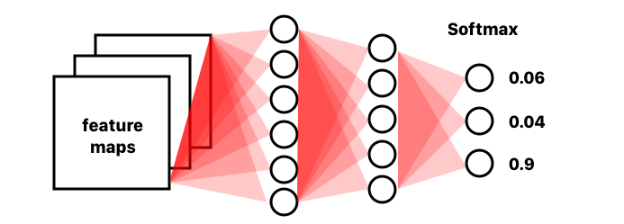

# Convolutional Neural Networks

{{TOC}}

_Lektion 5 og 6_

Interaktiv eksempel på  en CNN: [http://scs.ryerson.ca/~aharley/vis/conv/](http://scs.ryerson.ca/~aharley/vis/conv/)
## Motivation

## Arkitektur

~~En Convolutional er hvordan resultatet er af funktion $f$ hvorpå funktionen $g$ bliver påført, altså hvordan en kernel løber over et billede, for at lave et nyt billede.~~

CNN er en kategori af neurale netværk der har vist sig at være effektive til billede genkendelse og klassifisering; her i blandt til ansigter, objekter, skilte og så videre, til f.eks brug i robotter og selv kørende biler.

I modsætning til fully connected networks der er 2D, så er convolution layers delen 3D; med en højde, bredde og antal af channels.

For et convnet består arkitekturen af to dele: 

* første del handler om feature extraction
* anden del om klassifisering

### Feature extraction

Tager man et billede med et digital kamera, indeholder det typisk tre channels: red, green og blue.

Ideen er nu, at bruge disse channels på en anden måde. I stedet for at de repræsentere farve af et billede, skal de repræsentere features.

Features er interresandte dele ved et billede, det kunne være en ansigts struktur, det kunne være bestemte former eller mønstre og osådan.

Vi ønsker at kunne kigge på mange forskellige features, hvorfor vi ønsker at udvide vores antal af channels i vores billede.

Ideen ved feature extraction er, at vi vil starte med at finde noget helt basale features fra et billede, og ud fra de features vil vi så finde nye features osv. osv. osv.; altså at vi abstrakter featuresne mere og mere.

* Det kunne starte med at opdage kanter i billede
* Der så kunne bruges til simple former
* Der så længere nede kunne bruges til ansigter, eller biler osv

Til at lave feature extraction, bruger man hvad der kaldes et _convulational layer_. Sådan et lag virker ved at have et filter , f.eks af størrelsen 3x3. Dette filter bliver så _slidet_ over vores billede, og et nyt billede bliver lavet som output på dette.

Vores billede er jo blot en matrice af tal, og ligeså er vores filter også. Der bliver taget dot produktet af filteret, og de pixels som filteret står over, og dette bliver så en pixel i det nye billede. Så slider filteret til højre, med hvad der kaldes en _stride_, altså hvor mange pixels den skal gå til højre, for nu at udregne en ny pixel i det nye billede.

~~Dot produkt er at de tal der står oven på hinanden ganges sammen og så plussed alle disse produkter sammen. Man kan også tænke på det som en vægtet sum.~~

Det vil dog også sige, at størrelsen af outputtet er lidt mindre, eftersom at kanterne aldrig er i midten af filteret. Man kan udregne output størrelsen ved:

> $outputsize = \frac{inputsize - filtersize}{stride} + 1$

~~Man kan tilføje padding af 0’er til at fikse dette.~~

Faktuelt har et convolution lag en dybde, der fortæller hvor mange channels den skal outputte. Derved har den faktisk et filter pr lag som den bruger, og disse er forskellige så hver channel viser forskellige features.

Efter en convulation vil man ofte gerne introducere en activation funktioner. Forestiller vi os at vi slet ikke havde activation functions i vores netværk, ville det være lineær, hvor det ikke vil kunne løse non-lineær problemer, f.eks XOR. Det vil sige, at alle pixels nu skal _igennem en test_. Ved f.eks at bruge ReLU, så vil alle værdier der er under 0 blive erstattet af 0. Vi kunne også bruge tanh (mapper til [-1; 1] eller sigmoid (mapper til [0; 1])

> ReLU: max(0, x)

Vi vil gerne gå endnu mere abstrakt, og sådan et feature map indeholder meget unødvendig information. Derfor bruger vi et pooling layer, f.eks et max-pool. Et sådan layer har også et filter size og en stride. For max pooling, vil filteret tage den højeste værdi af et område og mappe det over til en ny channel. Derved får vi bare udtrukket de vigtige dele af et feature map, og har det nu bare på en mindre størrelse. Bruges et filter og stride på 2, halveres billedet.

Man behøver dog ikke at tage et pooling layer efter hver convolution layer. UNet kører f.eks to convlayers i træk før der er et pooling layer.

Efterhånden som man har flere omgange af disse conv+pool layers, så søger vi at at få flere channels og vores billede, men at billedet bliver mindre og mindre. Det betyder at vi kan genkende hvad der er i billederne, men vi har desværre mistet informationen om hvor det er.

- [x] Describe the difference between a sigmoid and a tanh
- [x] Explain the role of activation layers and mention examples of typical activation functions (like ReLU and sigmoid)
- [x] Explain what a pooling layer is, and what is the purpose of it
- [x] Explain how max pool works, and that it leads to some degree of translation invariance

### Classification

~~Før det kan blive fully connected, skal resultaterne først flades ud, da fully connected layers kun arbejder med vektorer.~~

For at bruge disse feature maps I de mange forskellige channels til at genkende forskellige ting, så bruges der nu nogle fully connected layers.

~~They are also called dense or linear layers.~~

Et fully connected layer betyder, at alle units i det tager input fra alle units før det og giver output til alle efter det. I dette tilfælde betyder det, at alle units i det første fully connected layer vil modtage et input fra hver pixel i alle feature map. Hver af forbindelse har så en vægt, og når de er ganget på og alt er plusset sammen, vil en unit så bruge sin activation function til at bestemme dens output.

Det sidste lag har så lige så mange units som antallet af de kategorier man forsøger af forudsige, og ved at bruge Softmax, vil de repræsentere sandsynligheder for at inputtet svarede til den label som uniten repræsentere. Det betyder også, at output laget summer op til 1.

~~LeNet var et af de første ConvNet~~

- [x] Describe the overall architecture of CNN classifiers (like LeNet and AlexNet)
- [x] Explain what a fully connected layer is and know that it only accepts vectors as input
- [x] Explain how 2D convolution works as a feature extractor and know the meaning of terms like filter/kernel and feature map (output of convolution)
- [x] Know that the intermediate feature representations in ConvNets are multi-dimensional volumes rather than vectors (as in fully connected networks), and that these volumes are called feature maps – also in relation to this know the meaning of terms like height, width, channel/depth

## Training

En ting er at bygge det her netværk, men det vil med alt sansynlighed ikke give nogle brugbare resultater før det er at vi har trænet det.

Træning handler om at justere vores vægte og filtre.

### Vægte og filtre
22. Explain why the weights of neural networks should be initialized with (small) random values, rather than all zeros.

Først og fremmest skal vi have en start værdi for vores filtre og vores vægte. Det dur ikke at sætte dem til 0, da alle så hvis alle neuroner outputtet det samme, vil alle parameter blive opdateres ens, og så kan det ske at der basicly ikke sker noget, altså netværket lærer intet. Altså er der ingen asymmetri mellem de forskellige units, hvis de har samme vægt.

Men hvad gør man så?

Hvis man bruger Sigmoid eller Tahn, kan man forsøge sig med den metode der hedder Xavier, og hvis man bruger RElU kan man prøve at bruge Kamming.

Xavier centrer sig med en mean på 0, og har en varians:

> $Var_{Xavier}(w_i) = \frac{1}{|units_{in}|}$

Hvor Kamming også centrer sig med en mean på 0, men har variansen:
> $Var_{Kamming}(w_i) = \frac{2}{|units_{in}|}$

### SGD

Hvis vi nu smider et billede fra vores træning set igennem vores netværk, vil det med alt sandsynlighed ikke forudsige den rigtige kategori. Dette er fordi at vores netværk ikke er trænet endnu, og vi vil derfor have hvad der betegnes som en høj _loss_ eller et godt dansk ord vil nok være en høj fejlrate. Denne ønske vi selvfølgelig går mod nul, hvor at netværket da vil kunne forudsige rigtigt.

Stochastic Gradient Descent, forkortet SGD, kan hjælpe os med at minimere dette loss.

Den normale _gradient descent_ udregner et loss ud fra resultater på hele datasetet, hvor den stokastiske udgave bruger en random mini-batch af n billeder og udregner derpå. Så SGD er derfor _stokatisk_ eller et estimat.

Men hvad er det nu lige gradient descent er?

Hvis vi siger at _loss’en_ for vores funktion er plottet og den ligner en skål, vil en tilfældig position på skålens overflade da være _loss’en_ for de vægte og filtre der er brugt der.

Vi ønsker at finde de vægte og filtre der er på bunden af skålen, hvor lossen er mindst, kaldet funktionens minimum.

For at komme derned af, laver _gradient descent_ få udregninger når langt fra den optimale løsning hvor vi har en større loss, og efterhånden som vi får en mindre loss, vil der laves flere udregninger.

_Gradient descent_ tager derved store skridt når den er langt væk, og små skridt når den er tæt på.

Starter man et tilfældigt sted _x_ og ser hvad kurvens hældning er der, så udregnes der et _stepsize_ ud fra denne, så næste hældning måles ved $x’$. Sådan et stepsize kan man udregne ved $s = y \cdot l$, hvor $l$ er en learning rate, f.eks. $0.1$, hvilket gør at vi hele tiden vil bevæger os mod 0. Man holder så også øje med hældningens fortegn, hvor hvis den ligepludselig ændre sig, har man måske taget et for stort skridt. Dog kan det også være at man blot er stødt på lokal minimum.

#### Problemer med SGD
Er der nogle problemer med at bruge SGD?
JA! Det kan være svært at finde en rigtig learning rate, og lossen er ikke som en simpel skål, og SGD kan f.eks have svært ved at navigere hvis den er i en kløft.

Når SGD befinder sig i en kløft, bruger den meget tid på at svinge op og ned af siderne, og kommer ikke særlig langt frem.

~~Forstå momentum her: [https://distill.pub/2017/momentum/](https://distill.pub/2017/momentum/)~~

Det kan man fikse ved at bruge momentum på sin SGD. Momentumet forhøjes da for dimensioner hvor gradienten peger i samme retning (ned af) og reduceres hvor gradienten skifter retning. ~~Vi husker at gradienten viser os kurvehældningen, og den ændre sig jo når vi går fra den ene side af kløften til den anden, men nedad er den bare ens.~~

- [x] Explain what stochastic gradient descent (SGD) is, including terms like “learning rate” and “mini-batch”
- [x] Mention challenges with standard SGD
- [x] Explain what momentum is, how it works, and intuitively why it improves SGD

### Transfer learning

Det kræver rigtig meget data at træne et convnet, og der er forskellige løsninger til dette. Enten kan man argumentere sit data, ellers kan man bruge transfer learning.

Hvis kigger på vores netværk som en encoder og en decoder i stedet for en feature extracter og en classifier; så vil vi kunne tage en pre trænet encoder og bruge den sammen med vores egen decoder.

Man kunne f.eks bruge en encoder der var trænet på ImageNet og så tilpasse vægtene selv i i decodern.,

- [x] Explain conceptually what transfer learning is, and how this is typically carried out for CNNs

