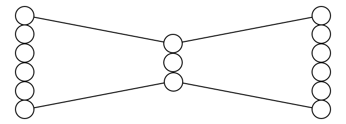
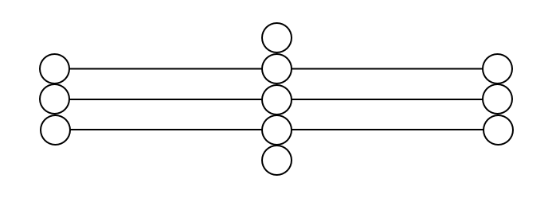
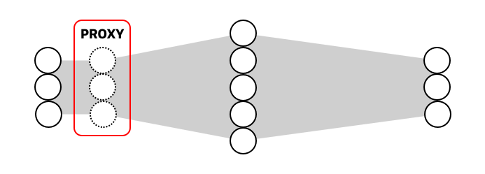

# 5. Generative models 
_Lektion 9_

{{TOC}}

## Motivation

## Unsupervised learning
Lad os først lige få på det rene, at der er forskellige måder at arbejde på.
Når vi snakker om _Unsupervised Learning_, så snakker vi om at vi kun har data. Hvad betyder det? Jo, når vi træner et netværk til klassificering, så gør vi det på et dataset af billede, men der er også beskrivelser af de billeder. Så ved at træne for klassificering på datasættet det indeholder $(x, y)$, så søger vi at finde den funktioner der mapper $x$ til $y$.
Anderledes er det dog ved _Unsupervised Learning_, for her har vi som sagt ingen labels, vi har kun data; derfor er det vi søger i stedet, at finde en struktur i den data som vi har, hvor et klassisk eksempel på hvad man kan bruge _unsupervised learning_ på er clustering eller region proposals.

Og hey, en fordel er at vi ikke _skal_ bekymre os om de labels! Sæt der mangler nogle eller de er forkerte! Det ville ødelægge vores netværk, så lad os i stedet se på hvad vi kan gøre når vi ingen labels har, men kun ren, rå data!

## Models

Så nu har jeg jo godt nok trukket emnet, _Generative models_, og jeg er startet ud med at diskuttere måder hvorpå man kan lære på; derfor skal vi naturligvis også lige snakke om de modeller der _kan_ lære.

En model kan enten være:

> * Generative

Eller

> * Discriminative

Helt basalt, så de Generative modeler kan genere nye datapunkter og de discriminative, well, discriminate i mellem forskellige data punkter, som en klassificer gør.

> * Generative: laver ny
> * Discriminative: klassifiere

Hvis vi har et set af data X med labels Y, så vil en generativ model arbejde med den forenede sansynlighed $P(X, Y)$ hvis der findes en $Y$, ellers bare $P(X)$, og en discrimativ model arbejder med den betingeede sandsynligheden $P(Y | X)$.

> * Generative: laver ny, $P(X, Y)$
> * Discriminative: klassifiere, $P(Y | X)$

~~Joint probability is simply the likelihood that two events will happen at the same time, independently. That means the outcome of event X does not influence the outcome of event Y.~~

Lad os tage lidt forskellige eksempler. Hvis vi leger med en model der kan forudsige det næste ord i en sekvens, så er det typisk en generativ model, fordi den kan forudsige en sandsynlighed for en sådan sekvens. En discrimitativ model vel være ligeglad med spørgsmålet om noget er sansynligt, men bare fortælle hvor sansynligt det er.

Det er meget sværere at arbejde med og træne en generativ model end en discriminative model; lidt på samme må som det kræver en meget dybere forståelse af et materiale for en lærer til at kunne uddybe det så alle elever forstår det, end det er for en elev bare at se ligheden. Læreren skal kunne vende teorien rundt og op og ned, for at nogle elever kan se det fra en ny vinkel og forstå det på deres egen måde.

En discriminative model skal måske bare lære at se forskel på tallet “0” og tallet “1”, mens en generativ model skal have så dyb en forståelse for begge tal, at den skal kunne lave nye udgaver af dem.

Og det er denne dybe forståelse der er dagens fokus, vi skal ind, helt ind i sindet. Og med sindet, mener jeg en autoencoder.

## Autoencoder

En auto encoder er et fully connected netværk, hvor inputtet og outputtet har lige mange units, derfor vil vi kunne forvente at outputtet ikke bare har samme størrelse som inputtet men vi vil også gerne forvente at det er det “samme” billede.

Men lyder det ikke bare som en dyr kopimaskine?

Well, der er en bestemt udfordring for autoencoderen, hvor der et sted blandt lagene er en bottleneck.

Dertil kan vi definere arkitekturen til at auto encoderen består af en encoder og en decoder; og når et billede ryger igennem systemet; hvor det bliver så småt, skal decoderen forsøge at genskabe billedet. Encoderen outputtet hvad der kaldes “hidden space representattion”, og Magien ligger så i, hvor tæt decoderen kan komme på det originale billede, når alt overflødigt støj fra billedet er væk. Dette skal så foregå kun med data, og derfor ingen labels.

At netværket har denne flaskehalse, gør at vi tvinger det til at lære strukturen på datan, så den kan genskabe en approksimeret version. Derved kan vi bruge en autoencoder til:

> * Formindske dimensioner
> * Feature extraction

Ofte når man har trænet en autoencoder, så smider man decoder delen væk og bruger encoderen til f.eks en supervised learning opgave, da vi nu mener encoderen er blevet god til at kompresse datoen.
~~Latent space == hidden space~~

Og som vi ser fra resten af deep learning feltet, så vil en auto encoder med flere lag i encodere og decoderen (kaldet en stcked autoencoder) også klare sig bedre. Hvor at lagene i decoderen så er en spejling af lagene i encoderen.

~~latent interpolation: smid “0” og “9” igennem encodere, så har man to _latent vectors_, kombiner disse med forskellige vægte, og se hvordan en forøgelse i den eneste vægt og forringelse i den andens, gør at decidere transformer resultater fra 1 til 9~~.

### Sparse Encoder
Vi kan stille et problem op, hvor at netværket er hvad der kaldes _overcomplete_, betydende at det hidden lag er større end IO lagene. Så kunne hver unit fra input bare mappe direkte over til en output unit.

En måde at fikse dette på, er ved at bruge en Sparse AutoEncoder som regulerings teknik. Simpelt så har det en begrænsning, hvor at det hidden layer ikke kan bruges fuldt ud; med at units kun nogle gange kan bruges. Det tvinger netværket til at bruge hele netværket og generalisere bedre.

### Denoising AE

En anden måde at fikse dette på, er ved at bruge en Denoising Autoencoder som også er en måde at regulere på. Jeg ser på dette netværk som om at det bruger en proxy.

I proxyen kan hver input nu blive ganget med 0, altså at det for hver passtrough er forskelligt om et signal går igennem en unit eller ej. Ved træning sammenligner man så ikke med proxyen, men med de originale inputs; der nu tvinger netværket til at generalizer selvom der er tilføjet støj.

### Convolutional autoencoders

Vi kan også gøre det, at vi erstatter de fully connected lag, med convolutional lag, da det historisk har vist sig at være bedre for billeder.

For et være korrekt, så vil encoderen bestå af Convolutionel lag til at udtrække features og maxpool til at formindske, og decoderen vil består af opsamling lag; der dog kan og ofte er, være transposed convolutional.

Hvorfor? Jamen vi har et lille space, som vi ønsker at gøre større; og vi ønsker at det skal gøres større så det matcher inputtet. Og at transfere et fearture map, til hvad feature mappet repræsentere er ikke bare noget man gør, det skal man lære! Og det er hvad man kan, med et _transposed convolutional_ lag, der har filtre som kan trænes.

### Variational autoencoders

En traditionel AutoEncoder har dog et andet problem, at den efterlader tomrum i dens latent space, hvilket man vil kunne se hvis man cluster plottede det. Dette er smart for decoderen da det gør det nemt at kende forskel for f.eks MNIST, men er vi i en _generativ model_ vil vi ikke bare kopier, men vi vil lave en ny variation. Så modellen vil ikke vide hvordan den skal sample noget fra et space mellem to clusters.

En _Variational autoencoder_ fikser dette problem, ved at sørge for der ikke er noget space mellem clusterne på den måde!

Men hov hov Magnus, jamen hvordan gør den lige det? Spørger i nok. Jo, den ligner på mange måde den traditionelle autoencoder, men i stedet for at outputtet af encodern er en vector af størrelsen *n*, så er det to vektorer af størrelsen *n*: en der repræsenteret *mean* og en der repræsentere *standart deviationen*. Hvilket betyder, at man nu har *distributionen* af de forskellige inputs ($X_i$). Fra dette, kan decoderen så begynde at lave random $X_i$ der falder inde fra deres distributionen. At vi kan gøre det på denne måde, så får vi et mere smooth latent space, da vi tillader at afvige lidt fra alt. ~~forestil dig punkter plottet, hvor hver punkt gløder.~~

Selvom vores clusters nu er gjort “bløde”, kan det dog sagtens stadig ske at de ligger langt væk fra hinanden! Derfor kan vi inkludere “KL Divergence” i vores loss funktion. Okay, jeg er ikke mester på det her punkt, men vi kan simplificere “KL Divergence” til _afstanden mellem probability distributions_, og det er jo hvad vores clusters er! Så ved at vores loss function også tager hensyn til “KL Divergence”, så kommer clusterne nu til at ligge tæt og være smooth.

## Generative Adversarial Networks

Godt vi er ved at løbe tør for tid, men lad os hurtig snakke om _Generative Adversorial Network_, eller GAN _for short.

En GAN, er et netværk der er den fødte skaber, som kan efterligne alle distributioner af data. F.eks genere billeder!

Netværket består egenligt af to undernetværker, en Generator og en Diskriminator.

Generatoreren, well sjovt nok, er den som genere nye ting, og diskriminatoren evaluere som om dette passer ind på træningsættet.

Det er jo faktisk meget simpelt.

Ud fra _random noise_ tager generatoren og laver, lad os sige et billede, det bliver så fodret til discriminatoren, der nu opretholder det mod faktiske billeder fra datasættet, hvor den nu skal gætte på om det nye billede kommer fra datasættet eller ej.

Et sådan kompleks netværk skal selvfølgelig trænes. Generatoren vil trænes med henblik på at at diskrinatoren altid tror generatorens billeder er ægte. Og diskriminatoren vil trænes på altid at kunne adskille generede billeder og ægte billeder. ~~Dårligt betegnet træning. Hjælp mig gerne her~~ Når de skal trænes dog, så er det anbefalet at de trænes seperat mod en statisk modstander.

~~The Generator network is able to take random noise and map it into images such that the discriminator cannot tell which images came from the dataset and which images came from the generator.~~

