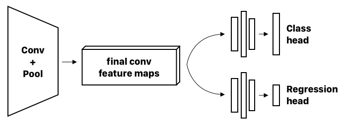
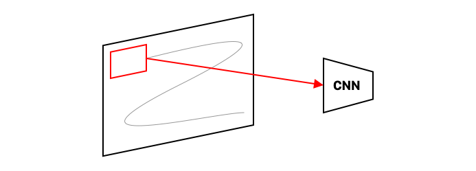
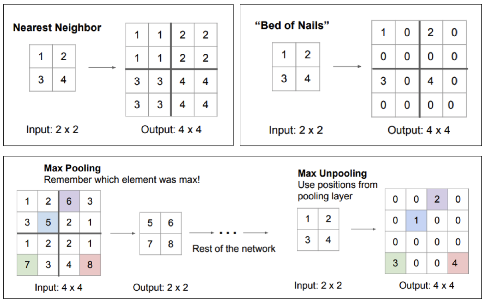

# 4. Object detection and segmentation 
_Lektion 8_

{{TOC}}

## Motivation

Godt så med et convolutional netværk er det muligt at blive meget klogere på hvad der i et billede og hvor der er, det er kernen i rigtig mange forbruger produkter i dag; som vores smartphones og biler.

I dag skal vi snakke om de arkitektoniske detaljer for at gøre sådanne ting.

Det hører vel under emnet _computer vision_ når vi begynder at snakke om at computeren ligesom “ser” hvad der er i et billede.

Men vi kan være mere specifikke end det, for der er forskellige måder at se på.

## Klassifikation

Når der kun er en enkelt ting på billedet, som vi netop ønsker at få klassificeret, så kalder vi det - ja, for en klassificering. 

> * Classification
> * Input: billede
> * Output: label
> * Evaluation: Accuracy

Så giver vi det et billede, får vi en label ud. Har vi da et labeled dataset, så vil vi kunne evaluere det på en accuracy, et simpelt nummer.

## Lokalisering

Det kunne også være vi ønskede lokalisere noget i et billede, så hedder det lokalisering.

> * Lokalisering
> * Input: billede
> * Output: x, y, h, w (bounding box)

Her indser vi dog, at det jo faktisk kan se denne lokalisering som et et regression problem; og at vi har med distancer at gøre, så vi kan bruge l2 loss.

## Kombination

Vi kan også kombinere de to opgaver, så vi ud fra et billede både for en label og en bounding box.

Til det er det muligt at bruge den samme convolutional encoder, men med to forskellige hovede, så man får to forskellige outputs.

Begge hovedet består så af fully connected layers og virker som to decoders; hvor den ene så giver giver en label og den anden giver bounding boxen.

## Object Detection

Vi kan også arbejde med at kunne finde og klassificer flere objekter i et billede.

Så hvis vi nu havde havde et billede af både en hund og en kat, så vil vi ikke bare vide disse kateogier, men også hvor i billedet de befinder sig.

### Sliding window

En måde vi kunne gøre det på, var at bruge sliding window. Ideen er, at man kører _classification_ flere steder på et billede.

Man har da et lille vindue, som typisk starter øverst i venstre hjørne af billede. Hvad vinduet ser smides så igennem en CNN for klassificering og resultatet gemmes. Nu flyttes vinduet lidt, og samme process sker så igen.

Når man er kommet hele vejen igennem billedet, har man så nok en masse labels fra de forskellige vinduer. Det er ikke bare langsomt, det kan også være upræcist.

Vi kan dog arbejde med hastigheden lidt. Med alle de billede fra vinduet, vil vil være meget langsomt at bruge en standart CNN på denne måde, grundet de mange forbindelser i de fully connected lag. Der jo for hver unit i et lag, har en forbindelse til hver unit i laget før den. Derfor har et fully connected det antal af parametre der svarer til, antallets af dets units gange antallet af laget før units:

> Betegner vi antal af units i en FC lag _l_ ved $u^l$
> FC _l_ Params: $u^l * u^{l-1}$

Forestiller vi os, at vi erstatter disse fully connected lag, med 1x1 convolutioner, og vi på forhånd har mappet vores feature maps ned til størrelsen af 1x1, så er antallet af parameterne pr. lag simpelt defineret ved antallet af kanaler.

Så går det da lidt hurtigere.

### Overfeat

Et andet problem er dog at størrelsen af ens sliding window er kontants, og at ikke alle ting har samme ratio som vinduet.

Overfeat arkitekturen tager en lidt anden tilgang til det, og bruger sammentidig det to-hovedet netværk vi beskrev i Classification + Localization.

Hvis vi simplificere det lidt, kan vi tage et eksempel.

Hvis vi siger at vi har et stort billede på 300x300, men netværket kun kan tage som input 200x200, så er dette vores vinduestørrelse. Vi bruger vinduet de fire gange de grænsede op til hvert hjørne. For hvert vindue, vil vi så smide resultatetet igennem vores to-hovedet cnn, og få en label+sansynlighed og en bounding box.

Overfeat bruger så den højeste score den har fundet, og merger de bounding boxes sammen til en forhåbentlig ordnlig boss ud fra heuistics.

I praksis bruger Overfeat dog mange flere position og størrelse og ratios af vinduet, der gør at arkitekturen også kan finde flere flere forskellige objekter i et billede.

### Region proposals

Men disse løsninger basere sig stadig på lading windows, hvilket vil sige der stadig er mange klassificeringer ved brug af CNN’en.

En løsning er simpelt bare at lave færre klassificeringer! Det kan vi gøre ved at foreslå nogle regioner hvor der kunne være noget vi skulle klassificere: dette kaldes _region proposals_.

Der er mange måde at foreslå regioner på, en af disse hedder _selective search_. Denne metode segmentere billeder ved cluster af pixels der ligner hinanden, eller af andre årsage baseret på tekstur, form eller størrelse; så man ender ud med et billede med nogle regioner af solid farve.

Man kan så tage bounding boksen af disse og klassificere dem.

### RCNN

“Regions with CNN features” som det vidst står for, virker netop ved at bruge sådanne regions.
De bruges så til at finde featuremaps fra et CNN, som der så bruges en Support Vektor Machine til at klassikere med.

Lad os starte ud med det mest basale af dem. 

1. For et billede, vil RCNN finde 2000 regioner. 
2. Disse warpes til at passe AlexNet, 227x277
3. For hver udtrækkes der så en 4096 feature vektor fra et modificeret AlexNet
4. Denne vektor bruges så til klassificering ved hjælp af SVM, og en bounding box findes ved regression.

Og det virker da, men det er langsomt. Ved at tage hver region igennem AlexNet, skulle det efterhånden pr. Billede tage 47 sekunder.

Fast R-CNN prøver at gøre om på dette, ved at bytte om på rækkefølgen, så hele billedet starter med at komme igennem CNN’en, og ud fra den feature map der fåes her, findes så regioner. Men i fastrcnn er der nogle FC lag, og sådanne lag forventer at få deres input i en bestemt størrelse $h \cdot w$. Deres bruges der er en _region of interest pooling_, hvor en _feature region_ bliver delt op i $h \cdot w$ og fra det max-pooles der så.

Hvad der nu er flaskehalsen i dette system, det langsommeste punkt, er region proposal delen.

Så hvad gør vi? Vi bruger Faster RCNN, hvor region proposal bliver en del af CNN’en! 
Eller, efter sidste feature map, så går det ind i et Regional Proposal Network.

Og med dette, er Faster RCNN blevet 250 gange hurtigere end RCNN.

## Instance Segmentation
Godt, så er vi nået til det sidste type a computer vision task som vi skal snakke om: instance segmentation. Det er en mere detaljeret af object detection, hvor vi rent faktisk vil kunne få en maske af det som er fundet og ikke bare en bounding box.

### Semantic segmentation

Er det ikke bare det samme som semantic segmentation? Kan man jo spørge sig selv.

Nej i semantic segmentation, bliver hver pixel kategoriseret. Så hvis der er to kører som står oven i hinanden, vil den _blop_ som de ocupier blot blive kategoriseret som “ko” og ikke at det er to køer.

Sådan et resultat kunne repræsenteres ved en one-hot encoding for hver kategori der kan genkendes af netværket, og så for hver one-hot, er alle de pixels der tilhører kategorien “1” og alle andre er “0”.

### FCN

En simpel måde at lave dette på, er vel egenligt bare FCN: Fully COnvolution Network; hvor de FC lag er erstattet af 1x1 conv lag.

Ved at der ikke er nogle FC lag, kan den arbejde med input af alle størrelser; dog er arbejdet samme størrelse som det sidste feature map; hvorfor der er brug for at upsample.

Vi kunne bruge forskellige måde at gøre dette på:

> * Nearest Neighbor upsampling: hver pixel værdi bliver lavet til fire pixel
> * Bed of nails: har vi en 2x2 der bliver til 4x4, som er 4 af 2x2 der er sammensat, så bliver øverst i hver hjørne sat
> * MaxUpPooling: man husker fra max-down hvilken position det havde

Men vi kunne også bruge som _transposed convolution_, som er learanble; og på mange måder kan vi godt sige det bare er en omvendt convolution. Men tconv kan have svært ved at genskabe tynde ting, f.eks ved en cykel+cykelrytter, så kan styret forsvinde ved segmantions resultatet.

Hvad vi ser her er altså, at des længere ned i netværket vi kommer, des mere ved nætværket hvad tingene er, men det mister information om hvor tingene er. Til det vil vi kunne bruge hvad kaldes for *skip connection*, som er direkte connection fra tidligere i netværket til senere. Hvad betyder dette? Det betyder at et tidligere sted i netværket, hvor at information om “hvor” tingene stadig var, sendes ikke bare dybere ned i netværket, men skipper også over flere lag og gå direkte ind i upsampling delen.

På den måde vil vi kunne få bedre resultater i forhold til de finere detaljer.

## Mask RCNN
Meget kort, kan vi vende tilbage til Instance segmentation.
Det kan Mask RCNN gøre, ved at bruge _objekt detection_ til at finde bounding boxes af de forskellige ting, og så bruge _semantic segmentation_ på hver af de boxes 

