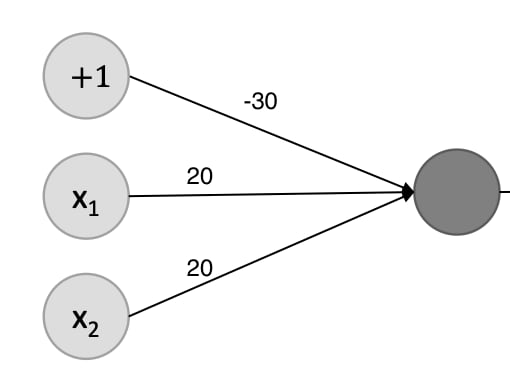

# 1. Traditional Neural Networks

{{TOC}}

## Regression

Hvad er regression? Med regression finder man den funktion der bedst beskriver sin data.

Så for en række punkter i et koordinat system, vil vi finde en funktioner der til dels beskriver dem; men ligeså også vil være generel for ny data.

### Lineær

Ideen bag *lineær regression*, er så at man finder en lineær funktion (altså en lige linje), der bedst beskriver forholdet mellem to variabler, f.eks detaljerne ved et hus og prisen heraf.

Så hvis vi siger prisen er $y$, og detaljerne er $x$, så søger vi en funktion $h$, så:

> $y = h(x) = a \cdot x + b$

Målet ved at gøre dette, er at vi skal kunne forudsige hvad resultat af $y$ er ud for en vektor af input værdier $x$, givet vi har fundet variablerne $a$ og $b$.

## Optimisering

Så for at kunne finde sådan en funktion $h(x)$, så vil vi gerne snakke om optimering.

For at optimere en lige linje, vil vi gerne at der er mindst mulig distance mellem linjerne og punkter, hvilket vil sige vi snakker om L2 normen, der på mange måder minder om Pythagoras. 

### Loss funktioner

*Loss funktioner*, er forskellige metoder hvorpå vi kan optimere en funktion til at repræsentere et forhold mellem tal.

Hvis vi forestiller os, at vi optimere vores funktion over flere omgange, så for hver omgang, vil vores *loss* funktion fortælle os hvor meget vores funktion afviger fra vores data. Vi ønsker at vi ender med en lille loss, og hvis vi optimere vores funktioner ud fra hver måling, så skal vi gerne se at vores loss bliver mindre og mindre og derved bedre repræsentere vores data.

### Gradient descent

Hvis vi siger at _loss’en_ for en ny funktion med en koefficient der er plottet og den ligner en skål, vil en tilfældig position på skålens overflade da være _loss’en_ for den værdi af koefficienten der er brugt der.

Vi ønsker at finde den koefficent der er på bunden af skålen, hvor lossen er mindst, kaldet funktionens minimum.

For at komme derned af, kan vi bruge _gradient descent_, der laver få udregninger når man er langt fra den optimale løsning, og efterhånden som vi får en mindre loss, vil der laves flere udregninger.

_Gradient descent_ tager derved store skridt når den er langt væk, og små skridt når den er tæt på.

Matematisk set, differentiere man sin _loss_ funktion og søger den værdi der er tættest nul. Starter man et tilfældigt sted _x_ og ser hvad kurvens hældning er der, så udregnes der et _stepsize_ ud fra denne, så næste hældning måles ved $x’$. 

Sådan et stepsize kan man udregne ved $s = y \cdot l$, hvor $y$ er hældningen ved $x$ og hvor $l$ er en learning rate, f.eks. $0.1$, hvilket gør at vi hele tiden vil bevæger os mod 0. Man holder så også øje med hældningens fortegn, hvor hvis den ligepludselig ændre sig, har man måske taget et for stort skridt. Dog kan det også være at man blot er stødt på lokal minimum.

For vores lineære ligning, virker det ved, at vi udregner en gradient for vores loss funktion. For vores L2 loss af $h(x)$ vil gradienten bestå af den afledte funktion med respekt til $a$ og respekt til $b$. Vi bruger så denne gradient til at _descende_ ned til det laveste punkt i loss funktionen.

### Learning rate

Vi nævnte før _learning rate_ der er et hyperparameter der bestemmer hvor meget vi justere vores koefficienter af hensyn til vores _loss gradient_. Har man en forkert learning rate, kan ens funktion enten overfitte eller underfitte.
Hvis den overfitter, siger man at den har husket data og derved ikke er god til at generaliser ny data, og hvis den er underfittet, vil den ikke kunne repræsentere variationen i daten.

## Logistic regression

I _logistic regression_ forudsiger vi om noget er sandt eller falsk, altså vi får et binært output.	 
Det er ikke en lige linje, men en “s”-shaped logistisk funktion. Kurven fortæller derved en sandsynlighed. Det er ofte brugt ved _klassifikation_.

Vi har derved

> $$P(y = 1 | x)=h(x)$$
> $$P(y = 0 | x) = 1 - P(y = 1 | x) = 1 - h(x)$$

Til at definere $h(x)$ bruger vi sigmoid funktionen, der for et input $x$ giver en tal mellem 0 og 1, hvilket svarer til en sandsynlighed.

> $$h(x) = \sigma(x) = \frac{1}{1+e^{-ax+b}}$$

Hvor $a$ giver hældning på kurven og $b$ forskyder den.
Målet er da at finde optimale $a$ og $b$ så sandsynligheden for at $h=1$ er høj når $x$ tilhører den ene klasse, og lav når den tilhører den anden.

## Decision Boundary og udfordringer

Siden _logistic Regression_ er en lineær classifier, kan vi nu opdele data der ligger i to grupper og kan deles af en lige streg; hvad der kan kaldes en _decision boundary_.

~~Den er lineær fordi x er lineær~~

Men hvad nu hvis vi en kategori ligger omkring origo, og den anden ligger i en ring uden om? Så vil det kræve en cirkel af skille dem ad.
Det viser sig, at hvis man laver koordinat systemet om til polar, så kan det stadig skelnes af en linje.

Men det er ikke nok, vi kan ikke klassikere mere avancerede ting som kvadranter, donuts eller tre grupper.

## Neurale netværk

Det er her neurale netværk kommer ind i billedet, så lad os hurtigt designe sådan et.

Dette er et simpel _fully connected network_, hvor hvert output er afhængig af alle output fra forrige lag.

Det består af et _input layer_ med tre units. De giver alle tre deres output til alle units i næste lag, der er et hidden layer, der igen med tre units alle giver deres output til output laget. Det ses også at de to sidste lag har en bias, som vi faktisk har set før i vores lineære regression. Det biasen gør, at det shifter resultatet.

En sådan unit i et hidden layer kaldes en _hidden unit_ og har en activation function; hvilket kunne være sigmoid. Man kan tænke på sådan en unit som et “template”, og hvis inputtet passer til dette template (f.eks at matche et 0-tal) i forhold til activation funktionen og vægten, så aktivere den. Hvis ikke vi havde disse aktiverings funktioner, ville netværket bare være en lineær tranformartion.

### Klassifisering

Skal sådan et netværk bruges til klassifisering, så hvis det er binært output, vil vores virke som det er nu.

Men skal man kunne genkende flere end to klasser, vil man have en output unit for hver klasse; og ved at bruge softmax funktionen, vil man da for hver unit få en sandsynlighed for at det er en tilsvarende kategori.

### Eksempel AND

Kan vi bruge et netværk til binary operationer? Ja det kan vi da!

Hvis vi har et lag med to input units og en bias, der alle fører til et output layer. Output layeret har så en sigmoid aktiverings funktion, og med en bias på $-30$ og weight på $20$

| x1 	| x2 	| h(x)                     	|
|----	|----	|--------------------------	|
| 0  	| 0  	| $\sigma (-30) \approx 0$ 	|
| 1  	| 0  	| $\sigma (-10) \approx 0$ 	|
| 0  	| 1  	| $\sigma (-10) \approx 0$ 	|
| 1  	| 1  	| $\sigma (10) \approx 1$  	|

