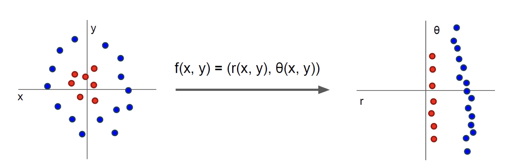
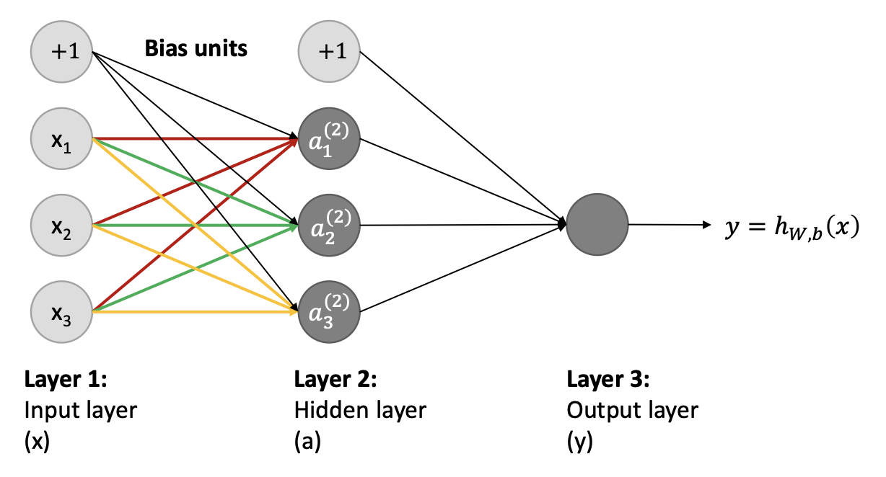
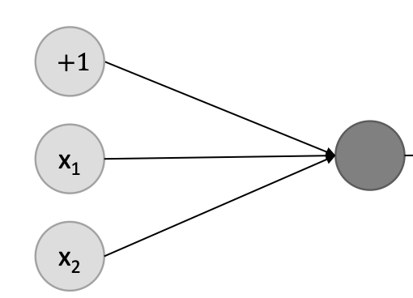

# 1. Traditional Neural Networks

{{TOC}}

_Lektion 3 og 4_ 

## 0. Motivation

Vi ønsker at lave et simpelt neuralt netværk.

## 1. Lineær regression

Først vil vi snakke lidt om lineær regression, for at få nogle begreber på plads.

Hvad er regression? Med regression finder man den funktion der bedst beskriver sin data.
Ideen bag *lineær regression*, er så at man finder en lineær funktion (altså en lige linje), der bedst beskriver forholdet mellem to variabler, f.eks detaljerne ved et hus og prisen heraf.
Dette skal forgå ved inputtet $x \in \R^m$ der give outputtet $y \in \R$.

Målet ved at gøre dette, er at vi skal kunne fremsige hvad en resultat $y$ er for en vektor af input værdier $x$.

### 1.1 Eksempel, huse
Lad os beskrive hvad vi kan bruge linear regression med, via et eksempel.

Hvis vi har et trænings-sæt af huse, så definere vi det _i’te_ hus’s detaljer (eller hvad vi kan kalde for _features_) for $x^i$ og prisen er angivet $y^i$.
> *Hus(i)*: Feature: $x^i$, pris: $y^i$ 

Har vi $n$ antal huse, hver med $m$ antal features, kan vores trænings sæt defineres ved:

> $\{y^i, x^i_1, x^i_2, ..., x^i_m\}^n_{i=1}$

Ud fra alt den her data, vil linear regression kunne hjælpe os med at lave en funktion $y=h(x)$, så $y^i\approx h(x^i)$

> $y=h(x)$ hvor $y^i\approx h(x^i)$

Og hvis det lykkedes os med at finde sådan en $h(x)$ funktion, så håber vi at kunne bruge den til at forudsige priser på andre huse.

Ved lineær regression, vil en sådan funktion udtage sig på formen:

> $y = a \cdot x + b$

## 2. Optimisering

For at kunne finde sådan en funktion $y=h(x)$, så vil vi gerne snakke om optimering.

For at optimere en lige linje, vil vi gerne at der er mindst mulig distance mellem linjerne og punkter, og den ved den korteste distance snakker vi da om L2 normen. 

* Explain conceptually what optimization is, and what is the purpose of it

### 2.1 Loss funktioner

Det lader os begynder at snakke om *loss funktioner*, der er forskellige metoder hvorpå vi kan optimere en funktion til at repræsentere et forhold mellem tal.

Hvis vi forestiller os, at vi optimere vores funktion over flere omgange, så for hver omgang, vil vores *loss* funktion fortælle os hvor meget vores funktion afviger fra vores data. Vi ønsker derved at vi har en lille loss, og at vi for hver omgang i vores optimere får en mindre loss, da det fortæller os at vores funktion bliver bedre til at repræsentere vores data.

 - [ ] Explain conceptually the difference between using L1 vs L2 regularization

#### 2.1.1 L2 

Som sagt før, så svarer L2 normen til den korteste distance, givet ved

> $||x||_2 = \sqrt{x_1^2 + x_2^2 + ... + x_n^2}$

At bruge den som _loss_ funktion, så bruges den til at minimere fejlen af summen af alle de kvadrerede forskelle mellem de rigtige værdier og de forudsagte værdier.

> $\sum_{i=1}^n(y_i - \bar{y}_i)^2$

Hvor $\bar{y}_i$ er vores forudsagte value.

Værdien heraf er da vores _loss_, men hvordan bruger vi den så?

### 2.2 Gradient descent

Hvis vi siger at _loss’en_ for vores funktion og dets koefficienter er plottet og den ligner en skål, vil en tilfældig position på skålens overflade da være _loss’en_ for de koefficienter der er brugt der.

Vi ønsker at finde de koefficenter der er på bunden af skålen, hvor lossen er mindst, kaldet funktionens minimum.

For at komme derned af, bruger vi _gradient descent_, der tager få udregninger fra den optimale løsning hvor vi har en større loss, og efterhånden som vi får en mindre loss, vil der laves flere udregninger.

_Gradient descent_ tager derved store skridt når den er langt væk, og små skridt når den er tæt på.

Matematisk set, differentiere man sin _loss_ funktion og søger den værdi der er mindst. Starter man et tilfældigt sted _x_ og ser hvad kurvens hældning er der, så udregnes der et _stepsize_ ud fra denne, så næste hældning måles ved $x’$. Sådan et stepsize kan man udregne ved $s = y \cdot l$, hvor $l$ er en learning rate, f.eks. $0.1$, hvilket gør at vi hele tiden vil bevæger os mod 0. Man holder så også øje med hældningens fortegn, hvor hvis den ligepludselig ændre sig, har man måske taget et for stort skridt. Dog kan det også være at man blot er stødt på lokal minimum.

Det virker ved, at vi udregner en gradient for vores loss funktion af vores funktion, for vores L2 loss af $h(x)$ vil gradienten bestå af den afledte funktion med respekt til $a$ og respekt til $b$. Vi bruger så denne gradient til at _descende_ ned til det laveste punkt i loss funktionen.

I gradient descent, bruger vi _partial derivative_ til at forstå forskellen i loss for hvad der sker isoleret set når vi ændre en variabel.

~~Når man har to eller flere afledninger af den samme funktion, så kaldes det en _gradient_.~~

Vi kan indsætte vores ligning for den forudsagte værdi:
> f(x, y) = $\sum_{i=1}^n(y_i - (a \cdot x_i + b))^2$

Vi bruger da det _partial derivative_ for de to værdier $a$ og $b$, til at lave en gradient

$$\Big \{\frac{\delta f}{\delta a}, \frac{\delta f}{\delta b}\Big \}$$

- [ ] (lav bedre Eksempel) Define the partial derivate of the L2 loss used in linear regression
- [ ] Know that polynomial fitting can be implemented using linear regression

### 2.3 Learning rate

vi nævnte før _learning rate_ der er et hyperparameter der bestemmer hvor mere vi justere vores koefficienter af hensyn til vores _loss gradient_. Har man en forkert learning rate, kan ens funktion enten overfitte eller underfitte.
Hvis den overfitter, siger man at den har husket data og derved ikke er god til at generaliser ny data, og hvis den er underfittet, vil den ikke kunne repræsentere variationen i datoen.

~~Hvis learning rate er for lav tager der mange epochs at nå minimum, og er den for høj kan den måske ikke nå derned~~

## 3. Logistic regression

I _logistic regression_ forudsiger vi om noget er sandt eller falsk, altså vi får et binært output.	 
Det er ikke en lige linje, men en “s”-shaped logistisk funktion. Kurven fortæller derved en sandsynlighed. Det er ofte brugt for _klassifikation_.

Vi har derved

> $$P(y = 1 | x)=h(x)$$
> $$P(y = 0 | x) = 1 - P(y = 1 | x) = 1 - h(x)$$

Til at definere $h(x)$ bruger vi sigmoid funktionen, der for et input $x$ giver en tal mellem 0 og 1, hvilket svarer til en sandsynlighed.

> $$h(x) = \sigma(x) = \frac{1}{1+e^{-ax+b}}$$

Hvor $a$ giver hældning på kurven og $b$ forskyder den.
Målet er da at finde optimale $a$ og $b$ så sandsynligheden for at $h=1$ er høj når $x$ tilhører den ene klasse, og lav når den tilhører den anden.

### 3.1 cross entropy

For logistic regression bruges ofte loss-funktionen _cross entropy_. Den beskriver et loss ud fra to sandsynligheds distributioner: de en model finder, og en one-hot vector af de virkelige sandsynligheder.

Losset er givet ved:

> $-\sum_{i=1}^n p_i \cdot \log q_i$

Hvor $p$ er sandhederne og $q$ er predictions.

Skulle man bruge logistic regression på billeder, ville man konventer dem om til vektorer og så regne med dem sådan. Til at starte med vil det ikke være præcist, men efter træning vil det nok. Her kunne $a$ og $b$ være erstattet af et $w$, som til at starte med bare er at billede af støj, men med tiden vil tage form.

### 3.2 Regulering

For at sørge for at såden en vægt blive trænet til at overfitte, og derved ikke kan generaliser data, bruger man _regularization_, altså at man regulere. Ved at bruge weight decay, tilføjer man en ekstra lag til ens loss funktion, der sørger for at fjerne vægte og holde ens model simpel.

## Decision Boundary og udfordringer

Siden _logistic Regression_ er en lineær classifier, kan vi nu opdele data der ligger i to grupper og kan deles af en lige streg; hvad der kan kaldes en _decision boundary_.

~~Den er lineær fordi x er lineær~~

Men hvad nu hvis vi en kategori ligger omkring origo, og den anden ligger i en ring uden om? Så vil det kræve en cirkel af skille dem ad.
Det viser sig, at hvis man laver koordinat systemet om til polar, så kan det stadig skelnes af en linje.

Men det er ikke nok, vi kan ikke klassikere mere avancerede ting som kvadranter, donuts eller tre grupper.

## Neurale netværk

Det er her neurale netværk kommer ind i billedet, så lad os hurtigt designe sådan et.

Dette er et simpel _fully connected network_, hvor hvert output er afhængig af alle output fra forrige lag.

Det består af en _input layer_ med tre units. De giver alle tre deres output til alle units i næste lag, der er et hidden layer, der igen med tre units alle giver deres output til output laget. Det ses også at de to sidste lag har en bias, som vi faktisk har set før. Det biasen gør, at det shifter resultatet.

En sådan unit I et hidden layer kaldes en _hidden unit_ og har en activation function; hvilket kunne være sigmoid. Man kan tænke på sådan en unit som et “template”, og hvis inputtet passer til dette template (f.eks at matche et 0-tal) i forhold til activation funktionen og vægten, så aktivere den. Hvis ikke vi havde disse aktiverings funktioner, ville netværket bare være en lineær tranformartion.

### Klassifisering

Skal sådan et netværk bruges til klassifisering, så hvis det er binært output, vil vores virke som det er nu.

Men skal man kunne genkende flere end to klasser, vil man have en output unit for hver klasse; og ved at bruge softmax funktionen, vil man da for hver unit få en sandsynlighed for at det er en tilsvarende kategori.

### Eksempel AND

Kan vi bruge et netværk til binary operationer? Ja det kan vi da!

Hvis vi har et lag med to input units og en bias, der alle fører til et output layer. Output layeret har så en sigmoid aktiverings funktion, og med en bias på $-30$ og weight på $20$

| x1 	| x2 	| h(x)                     	|
|----	|----	|--------------------------	|
| 0  	| 0  	| $\sigma (-30) \approx 0$ 	|
| 1  	| 0  	| $\sigma (-10) \approx 0$ 	|
| 0  	| 1  	| $\sigma (-10) \approx 0$ 	|
| 1  	| 1  	| $\sigma (10) \approx 1$  	|

