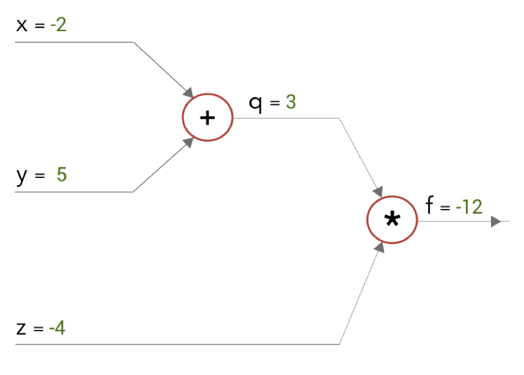

# Deeplearning eksamensnoter, efterår 2019

* 8 minuters eksamen

## 1. Overall learning goals
* Identify and describe visual recognition tasks that can be solved with deep learning.
* Describe and compare different neural networks architectures.
* Explain and compare techniques for training neural networks.
* Apply deep learning to standard visual recognition tasks and interpret the results.
* Design your own course project, implement it, experiment with it, analyse and relate the results to techniques and theories in deep learning for visual recognition.

## 2. Notation

> Ting der står sådan her, skal skrives på tavlen.

Ting der står sådan er, siger man.

~~Ting der står sådan her, er blot ting man skal vide.~~

## 3. Generalle ting at vide
_Baseret på lektion 1 og 2_.

### 3.1 Forskel på AI, ML og DL

* Artificial Intelligence: Er det generelle term, om en computer der virker som en menneskelig hjerne
* Machine Learning: er en sub-kategori og kræver meget manuel arbejde. Man definere f.eks selv sine _features_, og kan så træne. Mange parametre.
* Deep Learning: er en sub-kategori af machine learning. Her kaster man bare billeder og labels efter en struktur og træner; der er (relativt) ikke så meget man kan juster på, og det hele foregår meget som en blackbox. Består af neurale netværk, der via sine layers og connections imellem dem definere et billede.

### 3.2 Image classification

* _Image classification_ er en måde at klassificere hvad et billede repræsentere
* Det har mange udfordringer: 
	* Viewpoint kan være mærkelig
	* Belysning kan være dårlig
	* Skala kan være underlig
	* Noget kan være deformt
	* Noget kan være gemt væk
	* Det kan være mærkelige designs
	* Der kan være dårlig baggrund 
* At man bruger en _data driven_ tilgang, betyder at vi i kode ikke kan specificere at koden skal genkende en hund, men derimod kan vi træne på data der består af labeled billeder
* _Pipelinen_ for sådan et trick, hvor vi fra et array af pixels bestemmer en label, er som følgende:
	1. Vores input består af et sæt af _N_ billeder hver med mulighed for at være en af _M_ forskellige klasser.
	2. Vi _træner_ så vores _classifier_ på dette _trainingset_ til at kende hver klasse i sættet.
	3. Til sidst _evaluer_ vi på utrænede billede, hvor god den er til det.
* Et _trainingset_ er til at træne en model
* Et _testset_ er til evaluering af modellens kunnen når den er trænet 
* _K-Nearest Neighbours_
	* Er en simpel måde at klassificer data på
	* Man gemmer data og label for billeder
	* Når man vil _predicte_ hvilken label ny data har, ser man blot hvilket data der ligner mest og bruger den label.
		* Lad os forestille os, at alt data er plottet som et punkt hver i et koordinat system, så vil vi forestille os at de punkter der har samme _label_ ligger ved siden af hinanden.
		* Plot nu noget nyt data for at finde dens _label_
		* Hvis _K_ er _1_, så bruges label fra den der ligger tættest på, da denne ligner mest
		* Hvis _K_ er _\>1_, og de _K_ tætteste der ligger på kommer fra flere forskellige label, så er det den type som er flest af
	* Man skal prøve sig frem for at finde en god _K_
		* Er K for stor, kan små grupperinger blive ignoreret til fordel for store
	* Til at definere sådan længder, kan bruges to funktioner:
		* L1 finder den mindste absolutte forskel, og er ikke sensitiv til outliers
		* L2 finder kvadratiske fejlrate, og er sensitiv til outliers
	* KNN tager ingen tid at træne, da den bare gemmer data. Men den tager O(n) at predicate.
* _Hyperparamter_
	* Er parameter I forhold til modellen som vi sætter _før_ træning, så det er forskellen på hvilke parameter vi sætter og hvilke vi træner
	* Kunne for eksempel være vores learning rate, vores epochs, vores loss funktion
	* Vi kan finde de bedste ved at spille vores dataset op i tre forskellige:
		* Training set
		* Validation set
		* Testing set
	* Vi træner så via _training set_, sætter parameter via _validation set_ og evaluere via _testing set.
	* Derved kan vi evaluere hvordan parameterne virker på data der aldrig er set før
	* Man kan også bruge _cross validation_, hvor man kan har _training_ og _test set_, men _training_ splittes op i _n_ dele og man kører så _n_ gange hvor hver del får lov at være _validation set_, og så ser man hvilke parametre der gennemsnitligt klarer sig bedst. Det er ikke brugt meget i deep learning, da det tager lang tid med de store dataset vi har i deep learning.
* _Image Features_
	* Er dele af billeder der er interrestandte
	* Simple (dårlige) er f.eks rå-pixels (som KNN bruger) eller antal af bestemte farver farver
	* I stedet kan vi lære hvilke interesandte dele af at billede, der klassikere det
	* Dette kan gøre spå to måder:
		* Supervised (labels): bruges i neurale netværk
		* Unsupervised (ingen labels): bruges I K-means clustering
			* K-means bruges til at cluster (opdele) data, f.eks ved sociale medier data, markeds analyser etc.
			* Det parter _n_ observationer i _k_ clusters, hvor en ny observation tilhører den cluster med den nærmeste _mean_
			* Algoritme:
				* Lav _k_ tilfældige cluster
				* Loop
					* Tildel en observation til den nærmeste centroid(cluster) (L1 eller L2)
					* Opdater opdeling af centroid ved at udregne mean igen
* En måde at se hvor meget to vector ligner hinanden, er ved at tage deres _inner product_. Det hentyder til hvor meget en vektor _a_ reflekter på en vektor _b_, såfremt de begge har start i origin. Er vektorerne er normaliseret til at være længde _1_, så hvis inner produktet er _1_, er de ens og er det _-1_ er de modsætninger. Matematisk angives det: $||a||\cdot||b||\cdot cos \theta
* Et billede kan ses som en vektor, hvis vi kollapser rækkerne, f.eks ved brug af numpy
* *Curse of dimensionality*
	* I K nearest neighbours virker ved at finde områder i et fearture space hvor der grupperes
	* Men haves et stort feature space, kan det virke som om at intet minder om hinanden  
* En _weight matrix_ er en matrice af vektorer man kan bruge til at reducere et feature space
	* Haves f.eks et billede der kan være 30 forskellige kategorier, svarende til en vektor af $3072 \cdot 1$, så kan det ganges med en weight vektor af $30 \cdot 3072$, for at ende med en vektor af $30 \cdot 1$. Hver indgang svarer nu til sandsynligheden for at det er en kategori, hvilket er bedre til KNN.
		* For at lave sådan en weight vektor, kunne vi f.eks bruge CIFAR10 der er en masse billeder til 10 forskellige klasser. Tages der for hver klasse en mean af alle billederne der hører til, kan den nu bruges som features.
* Har vi et billede på vector form: $x$ og en weight vector (som beskriver features) $W$ så er $Wx = x’$, der kaldes en feature vector
* Siger vi at $w$ er en vektor af vægte der beskriver features, Så skulle vi lave en _linear classifier_ der kan fortælle om et billede er noget bestemt kunne vi finde et threshold hvor at sålænge $w \cdot x$ (inner produktet) er over et bestemt threshold, så tilhører det billedet. Det betyder at plotter vi tingene, vil der komme en lige linje der beskriver hvornår et billede er en bil eller ej.
* Men en linear classifier er ikke altid det vi skal bruge, hvordan vil de f.eks opdele en donut?
	* Dog kan en non-linear tranformation af feature spaced hjælpe her. Transferer man feature spacet fra til at bruge polar koordinater vil man nu kunne separer dem med en linje

## 3.3 Traditional Neural Networks
* Softmax regression er ligesom logistic regression, men med mere end to klasser, hvilket gør man kan klassificer inden for mange klasser. Outputtet er da en vektor af sandsynligheder for de forskellige klasser.
* Backpropagation foregår ved at starte bag fra ved output laget, og i forhold til ens loss - så kigger man på, hvor tæt var jeg på at give det rigtige resultat? Og justere vægt og bias ud fra det, så går man et lag tilbage, og spørger det lag: “Hvor tæt var jeg på at give det som det næste lag skulle bruge?” Og opdatere ud fra det osv.
* Overfitting sker hvis val_loss stikker af
* Vanishing gradient problem: tæt på 0 og 1 ændre sigmoid sig ikke meget, så gradienten herfra ville nærmest være usynlig hvis den bruges meget. Fix det ved at bruge noget andet, f.eks RELU
* saturation: er egentlig grunden til vasnishing gradient problemet, det er at funktioner bliver så flad at den afledte funktion ikke rigtig giver noget
* stochastic gradient descent udregner kun en gradient på noget af dataen i 
* andre aktiverings funktioner: RELU, LEAKYRELY, TANH
* perceptron: outputted kun binært
* logistic unit: outputter sandsynligheder
* Be familiar with the common neural network notation (x: input, y: output, W: weights, z: output before activation, a: output after activation)

## 3.4 Convolutional Neural Networks
* Importance of Bias
	* The main function of Bias is to provide every node with a trainable constant value (in addition to the normal inputs that the node receives).
* No computation is performed in any of the Input nodes – they just pass on the information to the hidden nodes.
* En bias er en vægt der bliver applied på tallet ‘1’, så det er bare biasen faktisk.
* Explain what is meant by “sparse interactions”, and what is the purpose of it
	* Et filter på et Convolutional layer er meget mindre end en vægt der skulle bruges på at matche et helt billede. Så det kræver mindre at arbejde med.
* Explain what is meant by “parameter sharing”, and what is the purpose of it
	* each member of the kernel is used at every position of the input (except perhaps some of the boundary pixels, depending on the design decisions regarding the boundary). The parameter sharing used by the convolution operation means that rather than learning a separate set of parameters for every location, we learn only one set.
* Explain what is meant by translation invariance, and where it comes from (see “equivariant representation”).
	* This ideally results in translation invariance: the same object with slightly change of position eventually fires up the neuron (in the last layers of the network) that is supposed to recognize that object.
* Know the difference between “valid” and “same” convolution in deep learning framework, like Keras
	* “valid” means no padding – convolution kernel must fit inside input image.
	* “same” means zeros-pad such that output has same shape as input.
* Know that convolution is a linear operation
* Describe ways to convert a feature map (volume) to a vector before being fed into a fully connected layer
	* Flatten
	* Global Average Pooling
* Explain what a computational graph is and illustrate an example, say f(x,y,z) = (x+y)*z
	* Det er bare at tegne det op, her er det for f(x,y,z) = (x+y)*z
	* 
* Explain how a forward pass is made in a computational graph (example is okay)
- [ ] Explain how a backward pass is made (example is okay), and how the chain rule is used to calculate the partial derivatives
- [ ] Explain conceptually the “chain rule in a neuron”
- [ ] Know that backpropagation for convolution can be mathematically derived using the “chain rule in a neuron” and that this involves two convolution operations as depicted in slide 109.
* Motivate the need for data preprocessing and explain what it typically involves (zero-centering and normalization)
	*  the datapoints lie “far” away from the origin. Small changes in the slope (weights) cause large changes in the loss. The resulting fluctuations in the loss makes gradient descent optimization very unstable.
- [ ] Explain how consecutive matrix multiplications can lead to numerical output values that either explode or vanish (example is okay), and describe the link to vanishing/exploding gradients in a neural network
* Motivate the two simple rules used to minimize the risk of vanishing/exploding gradients(see “sweet spot” slides)
	* The mean of the activations should be zero.
	* The variance of the activations should stay the same across every layer.
	* Brug Xavier eller Kaiming
* In overall terms describe what the layer activation statistics (histograms) should look like (or not look like)
	* Skal gerne gå fra en bue startende i -1 til 1, så variansen(?) er nogenlunde ens
* Motivate the use of batch normalization and explain how it works (including why it has two learnable parameters and what they are used for)
	* Det er et layer
	* We normalize the input layer by adjusting and scaling the activations. For example, when we have features from 0 to 1 and some from 1 to 1000, we should normalize them to speed up learning. If the input layer is benefiting from it, why not do the same thing also for the values in the hidden layers.
	* We can use higher learning rates because batch normalization makes sure that there’s no activation that’s gone really high or really low. And by that, things that previously couldn’t get to train, it will start to train.
	* It reduces overfitting because it has a slight regularization effects. 
	* Virker som _regularization_ ved runtime
* Explain what is meant by “regularization”, and how it relates to overfitting
	* Målet er regulere modellen så den virker på generelt data
	* Det kan vi gøre ved dropouts
	* tilføje noise til vores data
	* anden dataagumentation
	* early stopping 
* Describe what early stopping means, and how to detect when to stop training by inspecting loss curves
	* val_loss stikker af, så stop 
* Motivate the use of dropout and explain what it does
	* In each forward pass, randomly set some neurons to zero.
	* Dropout prevents neurons from co-adapting too much
* Motivate the use of data augmentation and mention examples of image augmentation
	* Seriøst?
* Explain what weight decay is and how it works
	* Ved at bruge weight decay, tilføjer man en ekstra lag til ens loss funktion, der sørger for at fjerne unødige vægte og holde ens model simpel.
* Know what hyperparameters are, and what hyperparameter tuning means
	* Det ved du godt
* Explain how the sigmoid works; that is approximately linear around x = 0; and that the derivative is close to zero when x is numerically large
	* [0; 1], hvor den ikke udvikler sig meget i ekstremerne
* Explain what it means for a sigmoid to be saturated, what causes it, and how it affects the training of a neural network
	* omkring ekstermene er der en lav gradient der gør det svært at træne
* Describe what happens to the gradients, when data (like output of a sigmoid) is not zero- centered
	* If the data coming into a neuron is always positive (e.g., x > 0 elementwise), then the gradient on the weights w will during backpropagation become either all positive, or all negative (depending on the gradient of the whole expression f).
	* This could introduce undesirable zig-zagging dynamics in the gradient updates for the weights.
	* However, notice that once these gradients are added up across a batch of data, the final update for the weights can have variable signs, somewhat mitigating this issue.
* Describe how the rectified linear unit (ReLU) works, and why it doesn’t saturate
	* max(0, x)
* Know that training is faster when using ReLU compared to when using sigmoid (according to AlexNet paper)
* Know what a dead ReLU is, and what causes it
		- A "dead" ReLU always outputs 0 for any input. Probably this is arrived at by learning a large negative bias term for its weights.In turn, that means that it takes no role in discriminating between inputs. For classification, you could visualise this as a decision plane outside of all possible input data.Once a ReLU ends up in this state, it is unlikely to recover, because the function gradient at 0 is also 0, so gradient descent learning will not alter the weights. "Leaky" ReLUs with a small positive gradient for negative inputs (y=0.01x when x < 0 say) are one attempt to address this issue and give a chance to recover.
* Explain how global average pooling works, and what is the advantage of this approach over simple flattening.
			- Laver en $h \cdot w \cdot d$ om til $1 \cdot 1 \cdot d$, hvor HW er avagared
* Describe conceptually what is meant by “receptive field” and explain why it increases when going deeper into the network (e.g., after max pool layers)
	* At de units dypere nede nærmest kan være connected til alle inputs fra begyndelsen (ligesom vi vel teoretisk set alle er i familie?)
* Describe how increasing the stride of convolution operations can have a similar effect as max pool, and explain why this might some times be a good idea (see “is max pooling deprecated?”)
	* Perform convolution with stride = 2.
	* Has the same effect of down-sampling by a factor of two (like max pooling normally does), but information is not thrown away in the same way as with max pooling.
- [ ] Explain how fully connected layers may be replaced with 1x1 convolutions, and that this enables ConvNets to accept inputs of arbitrary shape.
* Motivate learning rate decay and describe at least one way to implement it
	* Man kan starte ud med en høj learning rate, lige for at udforske det hele lidt, og så langsomt sænke den for at tune in på en local minimum.
	* Man kan f.eks sænke efter hver 5. epoch, eller når val_loss stopper med at forbedre sig
- [ ] Explain what zero padding is, and what is the purpose of it
- [ ] Explain how to calculate the zero padding size in such a way that the input height/width is maintained after the convolution operation, i.e., the formula (W-1)/2
- [ ] Motivate Adagrad and explain how it differs from standard SGD
	* Adagrad adapts the learning rate to the parameters, performing smaller updates(i.e. low learning rates) for parameters associated with frequently occurring features, and larger updates (i.e. high learning rates) for parameters associated with infrequent features. 
- [ ] Conceptually know what extra benefits might be achieved with Nestorov momentum, RMSProp and Adam
	- [ ] Adam er som en tung bold med friktion. Den løber hurtig ned af men vil have svært ved at gå op ad.
## 3.5 ConvNet architectures 

* Describe in overall terms the architecture of a ResNet
	* Er et meget dybt netværk som er bygget af _residual connection_
	* In a network with residual blocks, each layer feeds into the next layer and directly into the layers about 2–3 hops away. That’s it.
* Know that going deeper (increasing network capacity) does not necessarily improve network performance, and that this seems to be due to optimization problems, rather than overfitting (see ResNet motivation)
	* Gradienter bliver så små, at det er svært
- [ ] Motivate the use of residual blocks (ResNet)
- [ ] Explain how residual blocks work
* Know the difference between a type 1 skip connection and a type 2 skip connection
	* Skip 1: beholder shape
	* Skip 2: ændre shape, f.eks ved conv + batchnorm
* Motivate the use of depthwise separable convolution and explain how it works
	* FØLGENDE ER HVAD JEG TROR
	* Først splittes de forskellige channels op og der køres en conv $k \cdot k$ på hver
	* Så samles de igen og der køres en $1 \cdot 1$ conv på de forskellige pixels på tværs af lagene for at reducere dimensionerne
	* Det skulle efter sigende kræve færre udregninger
* Describe what an autoencoder is (input=output)
	* An autoencoder is an unsupervised machine learning algorithm that takes an image as input and tries to reconstruct it back using a fewer number of bits from the latent space representation.
	* For example, the neural network can be trained with a set of faces and then can produce new faces.
* Know what transpose convolution does, explain how it works, and that it has learnable parameters (as opposed to simple nearest neighbour upsampling)
	* det er jo bare en omvendt conv! Så derfor er det klart at der er learnable parakeet
* Explain why neural networks are not invertible (example is okay)
	* Many different inputs could have generated a particular output.
* Explain the concept of maximally activating patches and how it can be used to visualize what individual neurons react to
	* which images maximally activate some neuron
	* (1) Evaluate the validation database on the trained network.
	* (2) Record the nine highest activation values of each filter’s output.
	* (3) Project the recorded 9 outputs into input space for every neuron and extract the corresponding patch
	* OKAY LYT LIGE HER! Så vi bruger de 9 højeste values og projekter dem ind i vores dataset for at finde hvor de slår ud
	* Giver ikke mening
* Explain conceptually what a receptive field is and how its size increases for neurons that are deeper in the network
	* The receptive field is defined as the region in the input space that a particular CNN’s feature is looking at (i.e. be affected by).
	* 	A receptive field of a feature can be described by its center location and its size.
* Describe in overall terms what deconvolution does (as in ZF Net) and how it works
	* The objective of this is to project hidden feature maps back into the original input space
	* This allows us to visualize the activation functions of a specific filter.
* Explain how to obtain saliency maps by occlusion
	* Først .. havd er det?
		* Suppose that all the training images of bird class contains a tree with leaves.
		* How do we know whether the CNN is using bird-related pixels, as opposed to some other features such as the tree or leaves in the image?
		* Saliency maps tell us how different image regions affect the predicted class label.
		* Solution: Simple idea – mask part of the image before feeding to CNN, check how much predicted probabilities change.
- [ ] Describe in overall terms how to obtain class activation maps with Grad-CAM
* Know what an adversarial attack is
	* Adversarial examples are inputs to machine learning models that an attacker has intentionally designed to cause the model to make a mistake; they’re like optical illusions for machines.
* Explain in overall terms how texture synthesis works, including what a Gram matrix is, and what it does (intuitively). Also know what “style image” means.
	*  The purpose of texture synthesis is to generate high perceptual quality images that imitate a given texture.
	*  This can be done using a pretrained CNN classifier
* Explain conceptually how Neural Style Transfer works
	* Tage to billeder, og apply stylen fra det ene til det andet
- [ ] Explain conceptually how to visualize features using dimensionality reduction (including what t-SNE aims to do – but not necessarily how it does it...)
## Object detection and segmentation
* Describe conceptually what is meant by non-maximum suppression
* IoU
	* $IoU(A,B)=\frac{|A\cap B|}{A\cup B}$
* Motivate single-stage object detection (like YOLO) and explain conceptually how it works
	* Del et billede op i 7x7 og kategoriser hver celle
	* Find også bounding boxes I billedet og en confidence på hvor meget den tror det er et object
	* Smelt disse to ting sammen
* Describe the overall architecture of a U-Net
	* Læs min rapport
	* Ej okay, det er som et u
	* Der er en contracting-path og en expanding-path
	* I den første bliver billedet mindre og mindre med flere og flere channel; eftersom som det går igennem sæt af conv+conv+pool
	* I den anden fase, går skip-cons fra den første fase over, til denne, for at give information om hvor ting er, imens der blive rupsampled
## Generative Adversible Network

* Know what a Deep Convolutional GAN (DCGAN) is and what the overall network architecture looks like
	*  Bygget på convolution lag, der går fra en vector (n=100) af noise, 1024x4x4 ned til 3x64x64
* Know conceptually what a Conditional GAN is.
	*  At kunne genere et bestemt type billede? En one-hot vector bliver concaneret med noise inputtet, til at beskrive hvad den skal lave
* Mention examples of latent space arithmetic
	* Cluster 1: mand med briller
	* Cluster 2: mand
	* C1 - C2 = briller!
	* Så sådan et netværk burde vi kunne lave